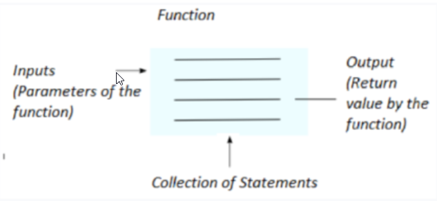
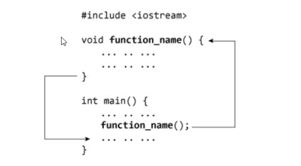

# **Function in Java**

A function is a collection of statements or a block of code that is used to perform some specific task. It is used to reuse the code without retyping the code. We can write the function once and use it many times. We don’t need to write the code again and again. The function is executed only when we call it. In Java, a function is also called a method.

**Method Declaration in Java:** The method declaration in java provides information about the method attributes such as method name, method return type, method visibility, method parameters, and the method body. Let’s look at the example of the method declaration

    public int max(int x, int y) {
        // Method body
    }

Here,

- **public:** the public is a modifier.
- **int:** int is a return type of method that means it returns an int value.
- **max:** max is the name of the method.
- **int a, int b:** int a, and int b is the list of parameters

**Example of Method Declaration:** In this example, we declare a method that accepts two parameters and returns the maximum of two numbers. Let’s look at the example:

    public int max(int x, int y) {
        if(x > y)
            return x;
        else
            return y;
    }

**Method Calling in Java:** Once we declare a method, we need to call this method to perform some specific task. When we call a method, the program controls transfer to the called method. Let’s look at the example.

    public class Example {

        // Function to return a maximum of two numbers
        public static int max(int x, int y) {

            if(x > y)
                return x;
            else
                return y;
        }

        // Driver Method
        public static void main(String arg[]) {
            int a = 10;
            int b = 20;

            // Method Calling
            int maximum = max(a, b);
            System.out.println(maximum);
        }
    }

**Output:**
    
    20

**How does function calling works?**

Consider the following code where there is a function called findsum which calculates and returns the sum of two numbers.

    class Solution {

        public static int findSum(int a, int b) {
            int sum = a + b;
            return sum;
        }

        public static void main(String args[]) {

            int a = 10;
            int b = 20;
            int c = findSum(a, b);
            System.out.println(c);
        }
    }

The function being called is called **callee**(here it is findsum function) and the function which calls the callee is called the **caller** (here main function is the caller) . When a function is called, programme control goes to the entry point of the function. Entry point is where the function is defined. So focus now shifts to callee and the caller function goes in paused state.

For Example: In the above code entry point of the function **findSum()** is at line number 3. So when at line number 9 the function call occurs the control goes to line number 3, then after the statements in the function **findSum()** are executed the program control comes back to line number 9.

**Why do we need function?**

- **Reusability:** Once a function is defined, it can be used repeatedly. You can call the function as many times as needed, which saves work. Consider that you are required to find out the area of the circle. Now either you can apply the formula every time to get the circle area or make a function to find the area of the circle and invoke the function whenever needed.

- **Neat code:** A code created with a function is easy to read and dry run. You don’t need to repeatedly type the same statements; instead, you can invoke the function whenever needed.

- **Modularisation:** Functions help in modularizing code. Modularisation means divides the code into small modules, each performing a specific task. Functions allow in doing so as they are the program’s tiny fragments designed to perform the specified task.

- **Easy Debugging:** It is easy to find and correct the error in function compared to raw code without function where you must correct the error everywhere the specific task of the function is performed.