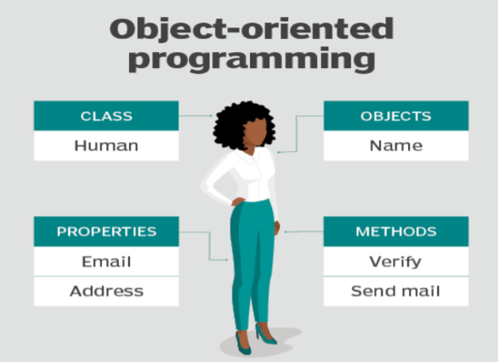
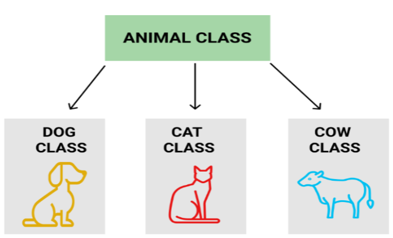
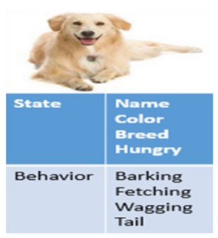

# **OOPs Definition**

### **Definition**

Object-Oriented Programming is a programming style that relates the programming to real-world entities/models. Object-Oriented programming is associated with the concept of class and objects. Oops tries to map the code/instructions with the real world, making the code short, simple, and easier to understand. Popular object-oriented programming languages are java, python, c++, etc. The main objective of OOPs is to provide certain features like data security, reusability and ensure a higher level of accuracy.

 

Nowadays, protecting data stored in a computer is a difficult task, particularly in a society that has become increasingly dependent on computer systems. This paper focuses on a new model proposed for data security and explores the extension of this model to object-oriented programming systems. With the help of oops concepts like inheritance, polymorphism, encapsulation, abstraction, it becomes easier and safe to model the real-world entities into the code/programs.

### **Advantages of OOPs:-**

- fast, easier to execute, maintain, modify and debug
- provides a clear structure for the programs
- helps to keep the Java code DRY "Don't Repeat Yourself."
- OOP makes it possible to create complete reusable applications with less code and shorter development time

### **Structure of object-oriented programming**

The structure of object-oriented programming like java includes the following things:

- **Classes** are user-defined data types that act as a blueprint for creating individual objects, methods, and properties.
- **Objects** are instances of a class. Objects can correspond to real-world entities like a human.
- **Methods** are functions that describe the behaviors of an object. Usually, programmers use methods for code reusability or keeping functionality encapsulated for security purposes. eg, verify, Sendmail, talk, etc
- **Attributes** represent the current state of an object. Objects will have data stored in the attributes field. e.g., color, score, email, etc

### **What Does a Class Mean?**

- In the context of Java, class is a template used to create objects and define objects' data types/properties and the methods.
- Classes are like categories, and objects are like items within each category.
- All the class objects should have the basic properties of the class.
- Main Core properties include the actual properties/attributes and methods used by the object.

## **Class explanation with real-world entities**

For example, a specific Dog is an object of the "Dogs" class in this real world. All Dogs in the world share some characteristics from the same template. Being an animal, they have a tail and are the faithful of all animals.

In Java, the "Dogs" class is the blueprint from which all individual Dogs can be generated that includes all Dog's characteristics, such as race, fur color, tail length, eyes shape, etc. So, for example, you cannot create a car from the dogs class because a car must have specific characteristics such as:- having an engine, windows, and lights — and none of these objects' properties can be found in the dogs class.

### **How to create Class in Java**

A class declaration contains the following parts:

- Modifiers (optional otherwise default modifier is considered by default)
- Class keyword followed by the Class name
- superclass with appropriate keyword extends (the name of a class' parent, if available)
- appropriate Keywords depending on whether the class implements one or more interfaces or extends from a superclass (if any)
- The class body should be enclosed within curly brackets {}

**Syntax:**

    Access-specifier/modifier class <className>{
        // properties
        // methods
    }

### **What Does Java Object Mean?**

- Java object is an instance of a Java class. Each object has a unique identity, a behavior, and a state of it.
- We store the state of an object in fields(variables), while methods show the object's behavior. JVM creates the Objects at runtime from templates, also known as blueprints/classes.
- In Java, we create an object using the keyword "new."
- Memory allocation takes place when the object is created
- The new keyword is used to allocate memory at runtime. All objects get memory in the Heap memory area.

### **Features used to characterize an object:**

- **State:** represents the properties of the object
- **Behavior:** represents the functionality of an object such as walking, talking, running, etc.
- **Identity:** An object identity is implemented by a unique ID. The value of the ID is hidden to the external user. It is only used internally by the JVM to identify each object uniquely.

### **Object explanation with real-world entities**

Java objects are pretty similar to what we come across in the real world like A Dog, a lighter, a cat, or vehicles are all objects.

For example, a dog's state includes its color, size, gender, and age, while its behavior is sleeping, barking, walking around like a security guard at 3 a.m.

### **How to create Object in Java**

Using the **new** keyword is the best way to create an instance of the class. When we create an object by using the new keyword, it allocates memory (heap) for the **object** and it also returns the **reference** of that object.

**Syntax:**

    <className> <objectName> = new <className>();

Let's create a program to get familiar with classes and objects

    public class Github {

        void show(){
            System.out.println("Welcome to Github");
        }

        public static void main(String[] args) {

            // creating an object using new keyword
            Github obj = new Github();

            // calling the method using the object
            obj.show();
        }
    }

Output:
    
    Welcome to Github   

### **Features of OOPs:-**

Four major object-oriented programming features make them different from non-OOP
languages:

- **Abstraction** is the property by virtue of which only the essential details are displayed to the user.
- **Inheritance** allows you to create class hierarchies, where a base class gives its behavior and attributes to a derived class.
- **Polymorphism** ensures that it will execute the proper method based on the calling object’s type.
- **Encapsulation** allows you to control access to your object’s state while making it easier to maintain or change your implementation at a later date