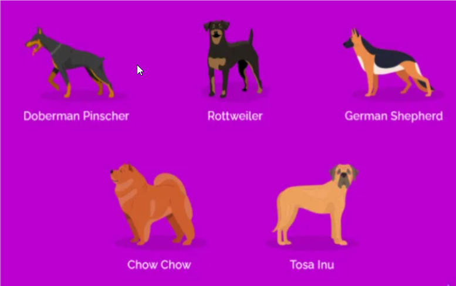
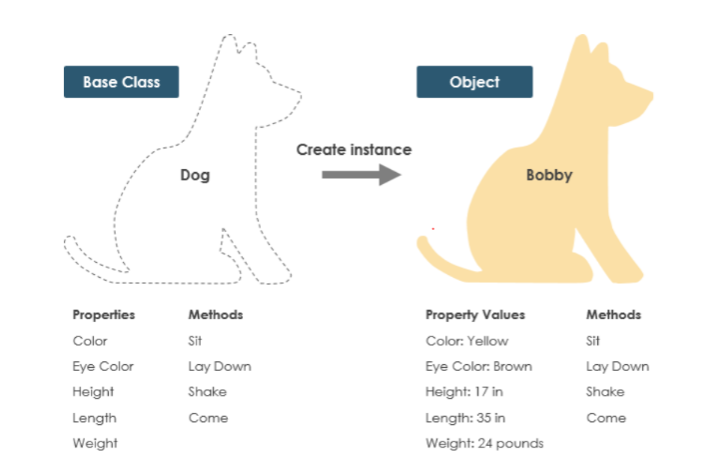

# **Real-world class modeling**

### **What is Real-world class modeling?**

Real-world Object-oriented class modeling designs and prepares the model’s code and structure similar to the real-world entity. During the programming phase of construction, the modeling is implemented by using a programming language that supports the object-oriented programming model.

Let us take the example of a dog. In our day to day life, we see dogs of various breeds having different colors, height, length, weight, eye color, etc.;-

So you can see here that different dog breeds are there depending upon the height, color, tail, etc., so we can create a real-world class simulating all the dog species depending upon the properties and methods of the class.

**Let’s model these real-world entities into the program.**

**Dog.java**

    class Dog {

        // properties of dog

        String name;
        String color;
        double height;
        double weight;
        double length;
        String eyeColor;

        // methods/functions that dog performs
        public void bark(){
            System.out.println(this.name + " bow-wow");
        }

        public void eat(){
            System.out.println(this.name + " is eating");
        }
    }

**Main.java**

    public class Main {
        public static void main(String[] args) {
            
            // Create the Doberman object
            Dog Doberman = new Dog();
            Doberman.name = "Doberman";
            Doberman.color = "Brown";
            Doberman.height = 3;
            Doberman.weight = 50;
            Doberman.length = 5;
            Doberman.eyeColor = "Black";
            Doberman.bark()
            Doberman.eat()

            // Create the Labrador object
            Dog Labrador = new Dog();
            Labrador.name = "Labrador";
            Labrador.color = "Black";
            Labrador.height = 2;
            Labrador.weight = 40;
            Labrador.length = 4;
            Labrador.eyeColor = "Brown";
            Labrador.bark()
            Labrador.eat()

            // Create the German Shepherd object
            Dog GermanShepherd = new Dog();
            GermanShepherd.name = "German Shepherd";
            GermanShepherd.color = "Black";
            GermanShepherd.height = 2.3;
            GermanShepherd.weight = 49;
            GermanShepherd.length = 5;
            GermanShepherd.eyeColor = "Brown";
            GermanShepherd.bark()
            GermanShepherd.eat()
        }
    }

**The output of the above-written program**
    
    Doberman bow-wow
    Doberman is eating
    Labrador bow-wow
    Labrador is eating
    German Shepherd bow-wow
    German Shepherd is eating

### **Why do we need Real-world object-oriented Class modeling?**

- To make the development and **maintenance** of projects more effortless.
- To provide the feature of **data hiding** that is good for security concerns.
- We can **solve real-world problems** by using object-oriented programming.
- It ensures **code reusability**.
- It lets us write **generic code**: which will work with a range of data, so we don't have to write basic stuff over and over again.