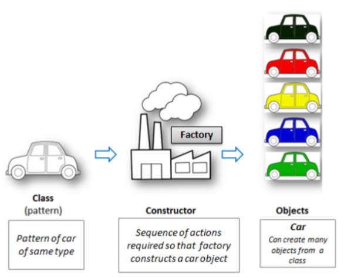
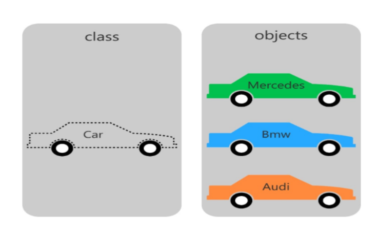
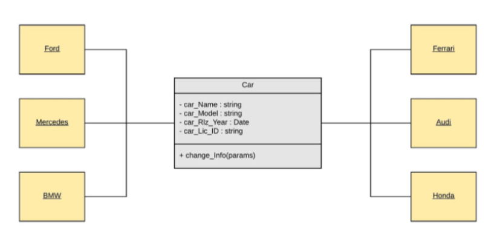
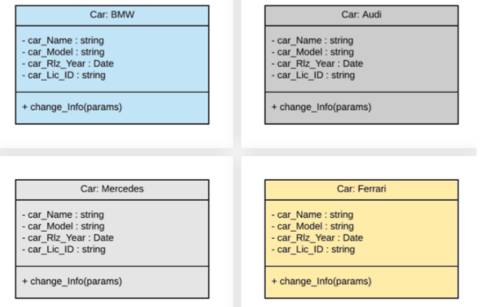

# **Example of OOPs in the Industry**

Let’s consider that you are the designer of the cars in the company. You have the sample car design and want to produce different cars with certain modifications in the sample so that something new can be launched in the market.

 

- Here we will make Car class, and it will work as a basic/sample template for other objects.
- We will make car class objects (Ferrari, BMW, and Audi).
- Each Car Object will have its Year of Manufacture(car_Riz_Year), model(car_model), name(car_name), registration Details (car_Lic_ID), etc.;
- you can further add properties if you want accordingly like TopSpeed, price,
efficiency, etc.

 

Here, car class would allow the programmer to store similar information unique to each car (different models, name, year of manufacture, top speeds, etc.) and associate the appropriate information.

### **Understanding example using flowchart:-**

 

### **Instances of a specific class can also be represented as follows :**

