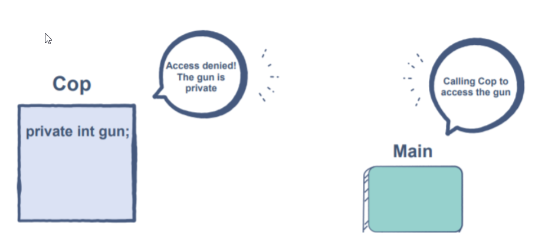

# **Access Specifiers**

## **Overview**

In Java, we can impose access restrictions on different data members and member functions. The restrictions are specified through access modifiers. Access modifiers are tags we can associate with each member to define which parts of the program can access it directly. There are three types of access modifiers. Let’s take a look at them one by one.

1. Private
2. Public
3. Protected
4. Default

### **Private:-**

A private member cannot be accessed directly from outside the class. The aim is to keep it hidden from the users and other classes. It is a popular practice to keep the data members private since we do not want anyone manipulating our data directly. We can make members private using the keyword *private*.

The access level of a private modifier is only within the class. It cannot be accessed from outside the class.

 

 

When we try to access private members from outside the class, then there will be a compile-time error.

    class Cop{

        private int gun; // We have explicitly defined that the variable is private

        // ...
    }

### **Public:-**

The public has the widest scope among all the modifiers. This tag indicates that the members can be directly accessed by anything anywhere, either in the same package, outside the package, inside another class, etc.

 

 

Here we can see that the getGun method is public, so we can call the public method from anywhere so the public method getGun will be called by the main method, and the getGun method has access to the private variable gun.

as the getGun() method and gun variable both are defined in the same class, so the getGun method will access the gun variable, and the getGun() method will be accessed by the main method.

This technique is used in data security, like those who design the program knows how to access those variables. Anyone who is an outsider will not be able to get access to private property. Just assume that you are designing the banking system, and any outsider tries to know the total cash in the bank so he will not be able to do so because he does not know which method he needs to call to fetch the data because the variable cash can’t be accessed directly as it is private.

    class Cop{

        private int gun; // We have explicitly defined that the variable is private

        public int getGun(){
            return gun; // The private variable is directly accessible over here!
        }

    }

Here we will create the object of Cop class in the main class and call the getGun() method with the help of object c.

    class Main{

        public static void main(String[] args){

            Cop c = new Cop(); // Object Created
            c.getGun()   // Can access the gun
            c.gun = 0;  // This would cause an error since gun is private
        }
    }

### **Protected:-**

The protected access modifier is unique. The level of access to the protected members lies somewhere between public and private. In Java, the protected access modifier behaves like default. But the primary use of the protected tag can be found when we use inheritance, we will cover inheritance in detail in the upcoming section of the course, as of now the protected data members can be accessed inside a Java package. However, outside the package, they can only be referred to through an inherited class.

**Cop.java**

    package justice;

    class Cop{

        private int gun; // We have explicitly defined that the variable is protected

        public int getGun(){
            return gun; // The private variable is directly accessible over here!
        }

        protected void fire(){
            System.out.println("Shoot!");
        }
    }

**Thief.java**

    package crime;

    import justice.Cop;

    class Thief{

        public static void main(String[] args){

            Cop c = new Cop();
            c.fire(); // This will work since fire() is protected
        }
    }

Class Thief will fall into a compile-time error because it is trying to access the method fire(), and we can see that it is defined in a different package.

### **Default:-**

If we don't use any modifier, then it is treated as the default access modifier. default is accessible only within the same package. It cannot be accessed from another package. It provides more accessibility than private. But, it is restrictive than protected and public

### **Tabular demonstration of all the access modifier/specifiers**

| Access Specifier | Class | Package | Subclass | Subclass outside package |
| --- | --- | --- | --- | --- |
| Public | Yes | Yes | Yes | Yes |
| Protected | Yes | Yes | Yes | No |
| Default | Yes | Yes | No | No |
| Private | Yes | No | No | No |
