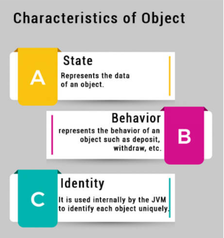
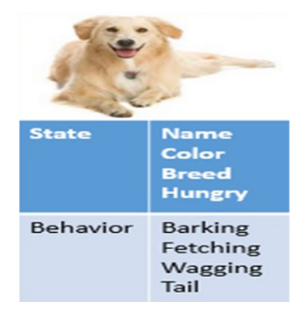

# **Object**

## **Object:-**

- In Java object is an instance of a Java class. Each object has a unique identity, a behavior, and a state of it.
- We store the state of an object in fields(variables), while methods show the object's behavior. JVM creates the Objects at runtime from templates, also known as blueprints/classes.
- In Java, we create an object using the keyword "new."
- Memory allocation takes place when the object is created
- The new keyword is used to allocate memory at runtime. All objects get memory in the Heap memory area.

### **Features used to characterize an object:**

- **State:** represents the properties of the object.
- **Behavior:** represents the functionality of an object such as walking, talking, running, etc.
- **Identity:** An object identity is implemented by a unique ID. The value of the ID is hidden to the external user. It is only used internally by the JVM to identify each object uniquely.

 

 

## **Object explanation with real-world entities**

Java objects are pretty similar to what we come across in the real world like A Dog, a lighter, a cat, or vehicles are all objects.

For example, a dog's state includes its color, size, gender, and age, while its behavior is sleeping, barking, walking around like a security guard at 3 a.m.

 

 

## **How to Create Objects in Java**

Using the new keyword is the best way to create an instance of the class. When we create an object by using the new keyword, it allocates memory (heap) for the object and it also returns the reference of that object.

**Syntax:**

    class_name object_name = new class_name();

Here you can see ClassName() is looking like a method used here, basically, it is a constructor, after keyword new constructor is called so here we will study what is the constructor;

## **Constructor:-**

constructor is a special method because it does not have a return type. We do not even need to write void as the return type. It is a good practice to declare/define it as the first member method. and its name should be the same as the name of the class.

It is called a constructor because it constructs the values at the time of object creation. It is not necessary to write a constructor for a class. It is because the java compiler creates a default constructor if your class doesn't have any.

It is a special type of method which is used to initialize the object.

## **Implementation:-**

**Let's create a program to get familiar with classes and objects**

    public class Github {

        void show(){

            System.out.println("Welcome to Github!");

        }

        public static void main(String[] args){
                
                // creating an object using new keyword
                Github obj = new Github();
    
                // invoking method using the object
                obj.show();
    
        }
    }

**Output:**
    
    Welcome to Github!