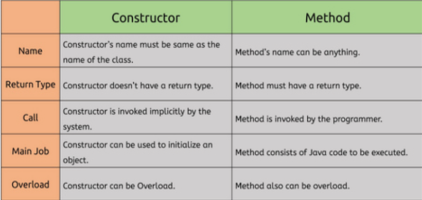

# **Interview Questions**

## **1. Is java a fully object-oriented programming language?**

Java is not a fully object-oriented programming language because it supports primitive data types like - int, byte, short, long, etc., which are not object-oriented and, of course, are the opposite of oops.

## **2. What are the advantages of packages in java?**

There are various advantages of defining packages in Java.

- Packages avoid name clashes.
- The Package provides easier access control.
- We can also have the hidden classes that are not visible outside and used by the package.
- It is easier to locate the related classes.

## **3. What happens if you don’t define a constructor in your class. Can we still create the object of that class?**

Yes, we can create that class’s object because the compiler automatically defines an empty, default constructor inside the class, which remains hidden to the programmer/user/outside world.

## **4. 4. Why is OOPs so popular?**

Oops is so popular because it helps in writing a complex piece of code easily, and it also allows users to handle and maintain them easily. With OOPs, the code’s readability, understandability, and maintainability increase multifold.

## **5. What are the difference between a class and an object?**

| **Class** | **Object** |
| --- | --- |
| Class is a data type | An object is an instance of the class |
| No memory is allocated when a class is declared | Memory is allocated as soon as an object is created. |
| It generates objects | It gives life to the class |
| Class is a logical entity. | An object is a physical entity.|
| A class can only be declared once. | Objects can be created many times as per requirement. |

## **6. What are the differences between the constructor and the method?**

 

 