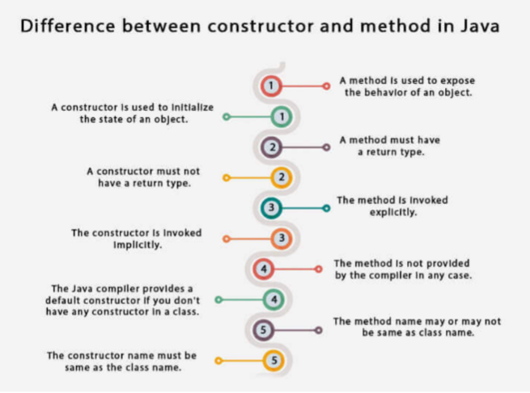

# **Constructor**

## **What is a Constructor?**

It is a special method that is used to initialize the object when an object of a class is created in the program. As the name suggests, the constructor is used to construct the object of a class. It is called when an instance of the class is created.

- A constructor’s name must be exactly the same as the name of its class.
- The constructor is a special method because it does not have a return type. We do not even need to write void as the return type.
- The purpose of a Java constructor is to initialize the newly created object before it is used.
- Every time an object is created using the new() keyword, at least one constructor is called.

There are two types of the constructors

- Default constructor
- Parameterized constructor

### **Default constructor**

A constructor is called a "Default Constructor" when it doesn't have any parameter.

**Main.java**

    public class Main {

        public static void main(String[] args) {
            // creating the object of the car class
            Car c = new Car();
        }
    }

    class Car {

        // default constructor
        Car() {
            System.out.println("Car is created.");
        }
    }

**Output**
    
    Car is created.

Here you can notice that we have created the object of the car class and the car constructor of the car class is called.

**Point to be remembered:** If there isn’t any constructor in a class, the compiler automatically creates a default constructor within the class that will not be visible to us.

Let us assume we have a bike class and we have not created any constructor within the bike class then in that situation compiler will create the bike() constructor automatically that will not be visible in the code.

 

 

**Main.java**

    public class Main {

        public static void main(String[] args) {
            Bike b = new Bike();
        }
    }

    // Bike class
    class Bike {

    }
    
Here you can notice that the program is still running as a default constructor will be created by the compiler automatically within the bike class which is not visible in the program.

**Purpose of a default constructor:-**

Basically, the purpose of the default constructor is to provide the default values to the objects like null, 0, etc. according to the type.

**Main.java**

    public class Main {
        public static void main(String[] args){
            // creating objects
            Student s1 = new Student();
            Student s2 = new Student();
            // displaying values of the objects
            s1.display();
            s2.display();
        }
    }

    // Student class
    class Student {
        int id;
        String name;
        // method to display the value of id and name
        void display() {
            System.out.println(id + " " + name);
        }
    }

**Output**
    
    0 null
    0 null

### **Parameterized constructor:-**

A constructor which has a certain number of parameters is called a parameterized constructor.

**Purpose of a parameterized constructor:-**

The parameterized constructor is used to initialize the object with different-different values.

**Main.java**

    public class Main {
        public static void main(String[] args){
            // creating objects and passing values
            Student s1 = new Student(111, "Karan");
            Student s2 = new Student(222, "Aryan");
            // calling method to display the values of object
            s1.display();
            s2.display();
        }
    }

    // Student class
    class Student {
        int id;
        String name;
        // creating a parameterized constructor
        Student(int i, String n) {
            id = i;
            name = n;
        }
        // method to display the value of id and name
        void display() {
            System.out.println(id + " " + name);
        }
    }

**Output**
        
    111 Karan
    222 Aryan

## **Java Copy Constructor**

There is no copy constructor in the Java language. But, we can copy the values from one object to another object like copy constructor in other programming languages. There are several ways to copy the values of one object into another object in Java. They are:

- By constructor
- By assigning the values of one object to another
- By clone() method of Object class

### **By constructor**

Here we are copying the values from one object to the other using the copy constructor CopyConstructroExample. You can see in the following code

**Main.java**

    class CopyConstructroExample {
        private double x, y;
        // A normal parameterized constructor
        CopyConstructroExample(double x, double y) {
            this.x = x;
            this.y = y;
        }
        // copy constructor
        CopyConstructroExample(CopyConstructroExample c) {
            System.out.println("Copy constructor called");
            x = c.x;
            y = c.y;
        }
        public String display(){
            return "(" + x + " + " + y + "i)";
        }
    }

    public class Main {

        public static void main(String[] args){
            class CopyConstructroExample c1 = new class CopyConstructroExample(10, 15);

            // Following involves a copy constructor call
            CopyConstructroExample c2 = new CopyConstructroExample(c1);

            // Note that following doesn't involve a copy constructor call as
            // non-primitive variables are just references.
            CopyConstructroExample c3 = c2;

            System.out.println(c2.display());
        }
    }

**Output**

    Copy constructor called
    (10.0 + 15.0i)

**Diff b/w Constructor and method in java**

You need to understand that constructor is different than the method in various ways:-

