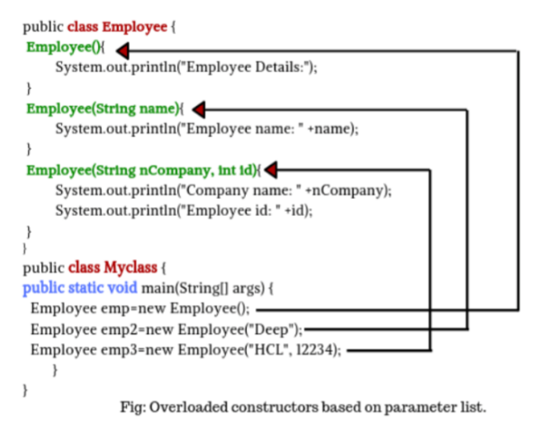

# **Constructor Overloading**

## **What is constructor overloading?**

A constructor is just like a method in Java, but it does not have any return type. It can also be overloaded, just like other methods.

Constructor overloading is a tool/technique of having more than one constructor in the class with different no of the parameters. Each constructor performs a different task. The compiler differentiates them by the total number of parameters and their types. Overloading means more than one form. It refers to the use of the same thing for a different purpose.

**Main.java**

    class Student {
        int id;
        String name;
        // constructor-1
        Student(int stdid, String stdname){
            id = stdid;
            name = stdname;
        }
        // constructor-2
        Student(int stdid){
            id = stdid;
        }
        void display(){
            System.out.println(id + " " + name);
        }
    }

    public class Main {
        public static void main(String[] args){
            // creating objects
            Student s1 = new Student(12);
            Student s2 = new Student(14, "Deepak");

            // displaying values of the objects
            s1.display();
            s2.display();
        }
    }

**Output**

    12 null
    14 Deepak

You can notice that here that I have created two different constructors.

- Student(int stdid , String stdname)
- Student(int stdid)

I have created two objects s1 and s2 using constructor-1 and constructor-2 respectively. So I have overloaded the constructor. Constructor-2 will not be able to initialize the name of the object so null is printed on the screen.

### **Example of constructor overloading.**

 

 

 

### **Key Points to remember:-**

1. Constructor overloading means having more than one class constructor with different signatures.
2. To compile each constructor must have a different no of parameters.
3. Parameter list consists of order and types of arguments.
4. We cannot have two constructors in a class with the same parameter lists.