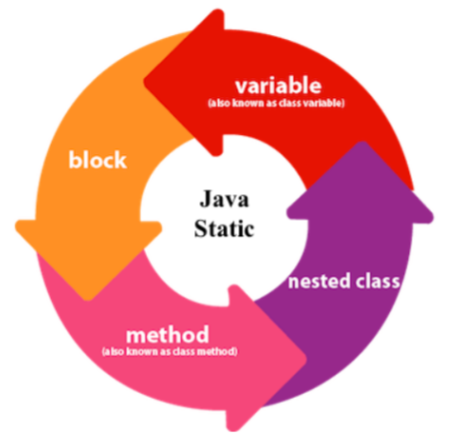
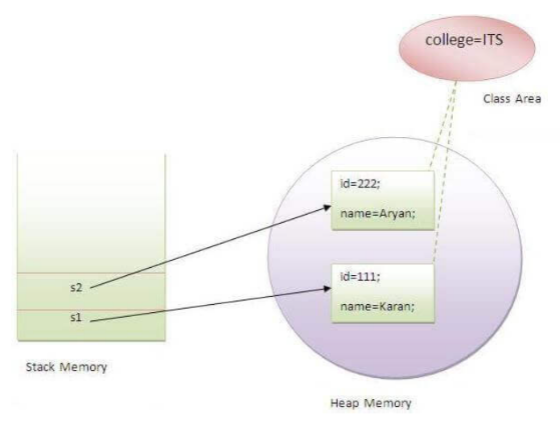

# **Static**

## **Static keyword**

The static keyword is used for memory management in java. The static keyword is used with methods, variables, blocks, and nested classes. Basically, the static keyword belongs to the class than an instance of the class. The static can be:

1. Variable (also known as a class variable)
2. Method (also known as a class method)
3. Block
4. Nested class

## **Java static variable**

When you use a static keyword with a variable, then it is known as a static variable.

- The static variable will be shared among all the objects of the class (which is not unique for each object),
- Memory is allocated to the static variable only once in the class area at the time of class loading.

### **Advantages of static variable**

It makes your program **memory efficient** (i.e., it saves memory).

Just go through the code, read the comments, and have a look over the output to get a better insight into the use of static variables.

    // Java Program to demonstrate the use of static variable
    class Student {
        int rollno;// instance variable
        String name;
        static String college = "ITS";// static variable
        // constructor
        Student(int r, String n) {
            rollno = r;
            name = n;
        }
        // method to display the values
        void display() {
            System.out.println(rollno + " " + name + " " + college);
        }
    }

    // main class to show the values of onjects
    public class TestStaticVariable1 {
        public static void main(String args[]) {
            Student s1 = new Student(111, "Karan");
            Student s2 = new Student(222, "Aryan");
            // we can change the college of all objects by the single line of code
            // Student.college="BBDIT";
            s1.display();
            s2.display();
            s1.college = "MIT";
            System.out.println("s1 changed the college name now let us see is it changed for s2 too ?");
            s1.display();
            s2.display();
            System.out.println("yes, if any object change that variable that changes will be reflected to all objects");
        }
    }

**Output:**

    111 Karan ITS
    222 Aryan ITS
    s1 changed the college name now let us see is it changed for s2 too ?
    111 Karan MIT
    222 Aryan MIT
    yes, if any object change that variable that changes will be reflected to all objects

 

 

## **Java static Method**

If you use a static keyword with any method, it is called a static method.

- A static method belongs to the class rather than the object of a class.
- A static method can be invoked without creating an instance of a class.
- A static method can access static data members and can change the value of it.

        class Calculate {
            static int cube(int x) {
                return x * x * x;
            }

            public static void main(String args[]) {
                int result = Calculate.cube(5);
                System.out.println(result);
            }
        }

**Output:**
    
    125

You can notice in the above example that cube method of the calculate class is called directly using the name of the class because static methods belong to the class rather than the object itself.

**Restrictions for the static method**

1. The static method cannot use non-static data members or call the non-static method directly.
2. this and super cannot be used in a static context.

**Main.java**

    class Main {
        int id=40; // non static

        public static void main(String arg[]){
            System.out.println(id);
        }
    }

**Output:**
    
        Main.java:6: error: non-static variable id cannot be referenced from a static context
                System.out.println(id);
                                    ^
        1 error

You can see that id is a non-static member and the main method is static so the compiler throws a compilation error in this situation.

## **Java's main method static?**

It is because the object is not required to call a static method. If it were a non-static method, JVM creates an object first then calls a main() method that will lead to the problem of extra memory allocation.

## **Java static block**
- used to initialize the static data member.
- executed before the main method at the time of classloading.

        class Main {
            static {
                System.out.println("This block is executed first than main method);
            }

            public static void main(String arg[]){
                System.out.println("This is main method");
            }
        }

**Output:**
        
    This block is executed first than main method
    This is main method

**NOTE:-**

We can not execute a program without the main() method. One of the ways was the static block, but it was possible till JDK 1.6. Since JDK 1.7, it is not possible to execute a Java class without the main method.