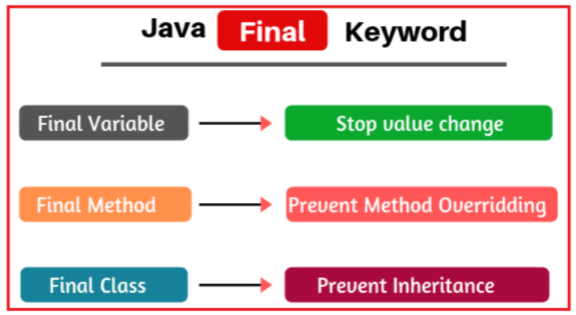

# **Final keyword**

The final keyword in java is used to restrict the user. Java final keyword can be used with the following.

1. Variable
2. Method
3. class

 

 

## **Java Final variable**

once the variable is declared as final then its value can not be changed. E.g. here in the example below, you can see that I have declared the variable speedlimit and initialized it with a value of 90. Now, with the run method's help, when I am trying to change its value, the compiler throws the error.

    class RollsRoyace {
        final int speedlimit = 90; // Final variable

        void run() {
            speedlimit = 400;
        }

        public static void main(String args[]) {
            RollsRoyace obj = new RollsRoyace();
            obj.run();
        }
    }

**Output:**
    
    RollsRoyace.java:6: error: cannot assign a value to final variable speedlimit
            speedlimit = 400;
            ^
    1 error

## **Java Final Method**

If you make any method as final, you cannot override it.

    class Bike {
        final void run() {
            System.out.println("running");
        }
    }

    class Honda extends Bike {
        void run() {
            System.out.println("running safely with 100kmph");
        }

        public static void main(String args[]) {
            Honda honda = new Honda();
            honda.run();
        }
    }

**Output:**
        
    Honda.java:5: error: run() in Honda cannot override run() in Bike
            void run() {
                ^
    overridden method is final
    1 error

Here you can notice that the run method of the Bike class can not be redefined in its child class as the run method is declared as final. So the compiler is throwing the error.

## **Java Final class**

If you make any class as final, you cannot extend it.

    final class Bike {
        void run() {
            System.out.println("running");
        }
    }

    class Honda extends Bike {// Compile Time Error
        void run() {
            System.out.println("running safely with 100kmph");
        }

        public static void main(String args[]) {
            Honda honda = new Honda();
            honda.run();
        }
    }

**Output:**
        
    Honda.java:1: error: Bike is not abstract and does not override abstract method run() in Bike
    final class Bike {
        ^
    1 error

Here you can notice that the Bike class is declared as final, so we are not able to override it; that’s why the compiler is throwing the error.