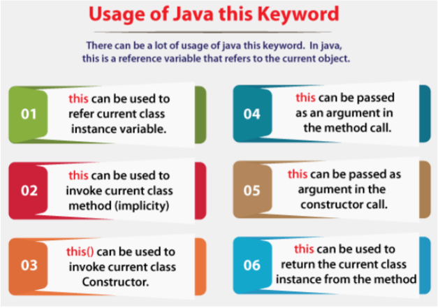

# **this keyword**

## **this keyword**

There can be a lot of usage of **Java this keyword**. In Java, this is a **reference variable** that refers to the current object.

 

 

### **this: refer to a current class instance variable**

there is ambiguity between the instance variables and parameters, this keyword resolves the problem of ambiguity.

Let’s take the case when we do not use this keyword then what happens actually

    class Student {

        int rollno;

        String name;

        float fee;

        Student(int rollno, String name, float fee){
            rollno = rollno;
            name = name;
            fee = fee;
        }

        void display(){
            System.out.println(rollno + " " + name + " " + fee);
        }
    }

    class Main {
        public static void main(String args[]){
            Student s1 = new Student(111, "stark", 5000f);

            s1.display();
        }
    }

**Output**

    0 null 0.0

now you can notice that the values of roll no, name and fee do not change even we have assigned the values in the constructor. this is because the compiler is not able to distinguish local variables and instance variables because of the same names. this issue gets resolved using this keyword.

    class Student {

        int rollno;

        String name;

        float fee;

        Student(int rollno, String name, float fee){
            this.rollno = rollno;
            this.name = name;
            this.fee = fee;
        }

        void display(){
            System.out.println(rollno + " " + name + " " + fee);
        }
    }

    class Main {
        public static void main(String args[]){
            Student s1 = new Student(111, "stark", 5000f);

            s1.display();
        }
    }

**Output**

    111 stark 5000.0

### **this: to invoke the current class method**

this can be used to invoke the current class method. But If you don't use this keyword, the compiler automatically adds this keyword while invoking the method. Let's see the example

    class ThisKeyWordDemo {

        void myfunction(){
            System.out.println("Hello you are my function");
        }

        void call(){
            System.out.println("Hello you are call");

            this.myfunction();
        }
    }

    class Main {

        public static void main(String[] args){
            ThisKeyWordDemo demo = new ThisKeyWordDemo();

            demo.call();
        }
    }

**Output**

    Hello you are call
    Hello you are my function

### **this: to invoke the current class constructor**

The this() constructor call can be used to invoke the current class constructor. It is used to reuse the constructor. In other words, it is used for constructor chaining.

    class ThisKeyWordDemo {

        ThisKeyWordDemo(){
            this(10);
        }

        ThisKeyWordDemo(int k){
            System.out.println("You have called the parameter constructor with value " + k);
        }
    }

    class Main {
        public static void main(String[] args){
            ThisKeyWordDemo demo = new ThisKeyWordDemo();
        }
    }

**Output**

    You have called the parameter constructor with value 10

### **this: to pass as an argument in the method**

The this keyword can also be passed as an argument in the method. It is mainly used in the event handling. Let's see the example:

    class ThisKeyWordDemo {
        int testValue = 3493;
        void func1(){
            System.out.println("Hello you are myfunction");
            func2(this);
        }
    }

    class Main {
        public static void main(String[] args){
            ThisKeyWordDemo demo = new ThisKeyWordDemo();
            demo.func1();
        }
    }

**Output**

    Hello you are myfunction
    3493

### **this keyword can be used to return the current class instance**

We can return this keyword as a statement from the method. In such a case, the return type of the method must be the class type (non-primitive). Let's see the example:

    class ThisKeyWordDemo {
        int testValue = 3493;
        void func1(){
            System.out.println("Hello happy learning");
        }
        ThisKeyWordDemo func2(){
            return this;
        }
    }

    class Main {
        public static void main(String args[]){
            ThisKeyWordDemo demo = new ThisKeyWordDemo();
            ThisKeyWordDemo returnObject = demo.func2();

            returnObject.func1();
        }
    }

**Output**

    Hello happy learning