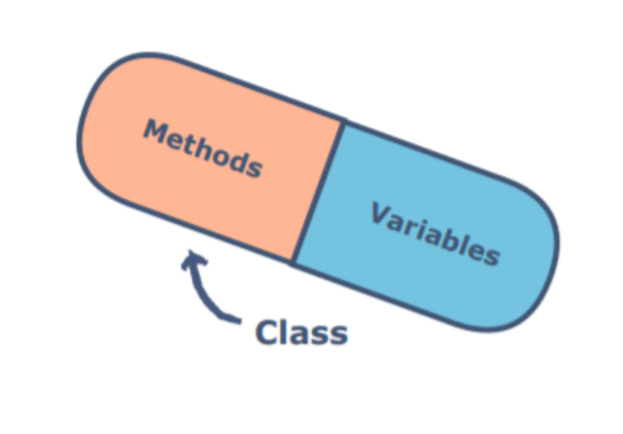
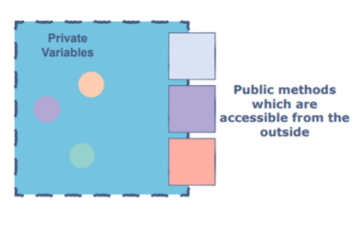
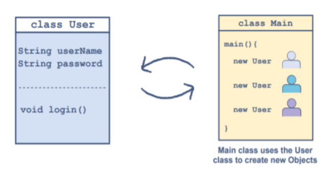

# **Encapsulation**

## **Definition:-**

Encapsulation is a fundamental programming technique in OOP used to achieve data hiding.

Depending upon this **unit**, objects are created. Encapsulation is normally done to hide the state and representation of an object from the outside. A class can be thought of as a **capsule** having methods and data members inside it.

 

 

As a rule of thumb, a good convention is to declare all the data members or instance variables of a class private. This will restrict direct access from the code outside that class.

At this point, a question can be raised that if the methods and variables are encapsulated in a class then “how can they be used outside of that class”?

Well, the answer to this is simple. One has to implement methods to let the outside world communicate with this class. These methods can be getters, setters, and any other custom methods implemented by the programmer.

 

 

## **Advantages of Encapsulation**

- Classes are easier to change and maintain.
- We can specify which data member we want to keep hidden or accessible.
- We decide which variables have read/write privileges (increases flexibility).

## **An Example of encapsulation:-**

As discussed earlier, encapsulation refers to the concept of binding data and the methods operating on that data in a single unit also called a class.

The goal is to prevent this bound data from any unwanted access by the code outside this class.

Let’s understand this using an example of a very basic User class. Consider that we are up for designing an application and are working on modeling the log-in part of that application. We know that a user needs a username and a password to log into the application.

A very basic User class will be modeled as: Having a field for the userName Having a field for the password A method named login() to grant access Whenever a new user comes, a new object can be created by passing the userName and password to the constructor of this class. class User String userName String password void login()

 

 

## **How can we implement Encapsulation in java:-**

**EncapTest.java**

    public class EncapTest{
        private String name;
        private String idNum;
        private int age;
        
        public int getAge(){
            return this.age;
        }
        
        public String getName(){
            return this.name;
        }
        
        public String getIdNum(){
            return this.idNum;
        }
        
        public void setAge(int newAge){
            this.age = newAge;
        }
        
        public void setName(String newName){
            this.name = newName;
        }
        
        public void setIdNum(String newId){
            this.idNum = newId;
        }
    }

**Note:-**

Here you can see getter and setter methods we have used here in order to change the private data members of the class because these variables are only accessible to class methods and variables and any outside class member or object can not change these private variables. so this is the concept of encapsulation.

**RunEncap.java**

    public class RunEncap {

        public static void main(String[] args){
            EncapTest encap = new EncapTest();
            encap.setName("James");
            encap.setAge(20);
            encap.setIdNum("12343ms");
            
            System.out.println("Name: " + encap.getName() + " Age: " + encap.getAge());
        }
    }

**Output:-**
    
    Name: James Age: 20