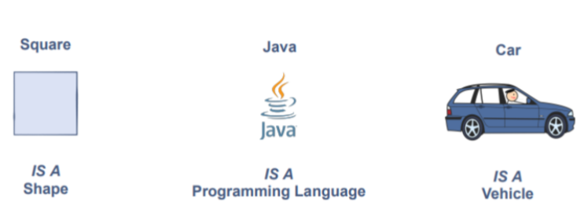

# **Inheritance**

## **Definition:-**

Inheritance is a mechanism in which one object acquires all the properties and behaviors of a parent object. It is an important part of oops

Inheritance provides a way to create a new class from an existing class. The new class is an extended version of the existing class such that it inherits all the non-private fields (variables) and methods of the existing class. The existing class is used as a starting point or as a base to create the new class.

## **The Is-A Relationship**

After reading the above definition, the next question that comes to your mind is What is the use case of inheritance? Well, the answer is that wherever we come across an IS-A relationship between objects, we can use inheritance.

 

 

 

 

## **The Has-A relationship**

 

 

here you can see these are not is-A examples instead these are Has-A relationships between them.

## **Types of Inheritance:-**

On the basis of class, there can be three types of inheritance in java: single, multilevel, and hierarchical.

In java programming, multiple and hybrid inheritance is supported through interface only. We will learn about interfaces later.

1. Single
2. Multi-level
3. Hierarchical
4. Multiple
5. Hybrid

 

 

**Note: -** Multiple inheritance is not supported in Java through the class.

When one class inherits multiple classes, it is known as multiple inheritance.

**For Example:**

 

 

## **Single Inheritance**

When a class inherits another class, it is known as single inheritance.

    class Animal {

        void eat(){
            System.out.println(" Is eating the break);
        }
    }

    class Dog extends Animal{

        void bark(){
            System.out.println("Is barking over the thief");
        }
    }

    class Main{
        public static void main(String[] args){
            Dog d = new Dog();
            d.bark();
            d.eat();
        }
    }

**Output:-**
    
    Is barking over the thief
    Is eating the break

## **Multilevel inheritance**

When there is a chain of inheritance, it is known as multilevel inheritance.

    class Animal {

        void eat(){
            System.out.println(" Is eating the break);
        }
    }

    class Dog extends Animal{

        void bark(){
            System.out.println("Is barking over the thief");
        }
    }

    class BabyDog extends Dog{

        void weep(){
            System.out.println("Is weeping ...");
        }
    }

    class Main{
        public static void main(String[] args){
            Dog d = new Dog();
            d.weep();
            d.bark();
            d.eat();
        }
    }

**Output:**

    Is weeping ...
    Is barking over the thief
    Is eating the break

## **Hierarchical inheritance**

When two or more classes inherit a single class, it is known as hierarchical inheritance. here in the example below, you can see two different classes are inherited through the same single class.

    class Animal {

        void eat(){
            System.out.println(" Is eating the breakfast);
        }
    }

    class Dog extends Animal{

        void bark(){
            System.out.println("Is barking over the thief");
        }
    }

    class Cat extends Animal{
            
            void meow(){
                System.out.println("Is meowing due to fear");
            }
    }

    class Main{
        public static void main(String[] args){
            Cat c = new Cat();
            c.eat();
            c.meow();
        }
    }

**Output:**
    
    Is eating the breakfast
    Is meowing due to fear

## **multiple inheritance is not supported by java?**

To reduce the complexity and simplify the language, multiple inheritance is not supported in java