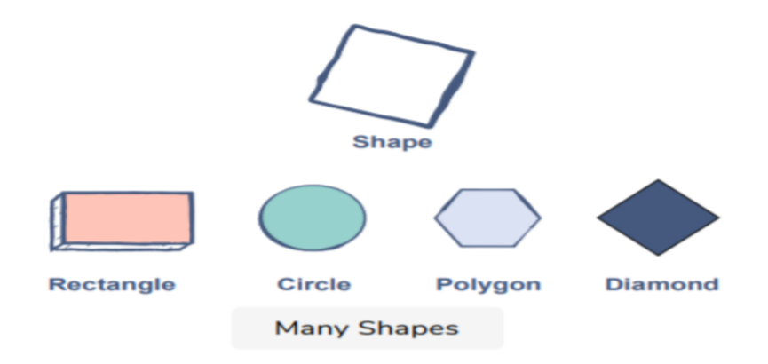
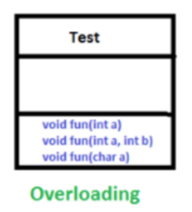

# **Polymorphism**

## **Definition:-**

The word Polymorphism is a combination of two Greek words, Poly means many and Morph means forms.

In programming, polymorphism refers to the same object exhibiting different forms and behaviors. For example, take the Shape Class. The exact shape you choose can be anything. It can be a rectangle, a circle, a polygon, or a diamond. So, these are all shapes but their properties are different. This is called Polymorphism

 

 

## **Types of polymorphism**

- Compile-time polymorphism
- Runtime polymorphism

### **Compile-time polymorphism**

It is also known as static polymorphism. This type of polymorphism is achieved by Method Overloading or operator overloading

**Note:-** operator overloading is not supported by java.

#### **Method overloading:-**

when we have more than one function/method in the same class with the same name and number of arguments. then these functions are known as overloaded functions. Functions can be overloaded by a change in the number of arguments or/and a change in the type of arguments.

**Note:-**different return type is not considered as overloading.

 

 

Here, you can see there are three functions in the same class having the same name and the same number of arguments. So these functions are overloaded.

Here we will look at an example of the same with the help of a program written in java. We have overloaded multiply function using different arguments types, and a number of arguments are different in each function.

**Main.java**

    // Helper class
    class Helper {

        // Method with 2 integer parameters
        static int multiply(int a, int b) {
            return a * b;
        }

        // Method with the same name but 2 double parameters
        static double multiply(double a, double b) {
            return a * b;
        }

        // Method with the same name but 3 integer parameters
        static int multiply(int a, int b, int c) {
            return a * b * c;
        }
    }

    // Main class
    class Main {
        public static void main(String[] args) {

            System.out.println(Helper.multiply(2, 4));

            System.out.println(Helper.multiply(5.5, 6.3));

            System.out.println(Helper.multiply(2, 7, 3));
        }
    }

**Output:-**
    
    8
    34.35
    42

### **Run-time polymorphism**

It is also known as Dynamic Method Dispatch. It is a process in which a function call to the overridden method is resolved at Runtime. Method Overriding achieves this type of polymorphism. On the other hand, method overriding occurs when a derived class has a definition for one of the member functions of the base class. That base function is said to be overridden.

#### **Method overriding**

In a simple language, when we have two classes, one is child class, and the other is parent class, and when we write the same function in both the child class and the parent class, the method is said to be overridden. This concept is known as runtime polymorphism because the compiler will decide at runtime to which function it will call during the program's execution.

**Note:-** Overriding is not possible in the case of static methods.

    class Vehicle {
        void run() {
            System.out.println("Vehicle is running");
        }
    }

    class Bike extends Vehicle {
        void run() {
            System.out.println("Bike is running safely");
        }
    }

    class Main {
        public static void main(String[] args) {
            Vehicle b = new Bike();
            b.run();

            Vehicle v = new Vehicle();
            v.run();
        }
    }

**Output:-**
    
    Bike is running safely
    Vehicle is running

Here, you can easily understand that the run method is called at the runtime, according to whether the vehicle is behaving like a car, or the vehicle is behaving like the vehicle itself.