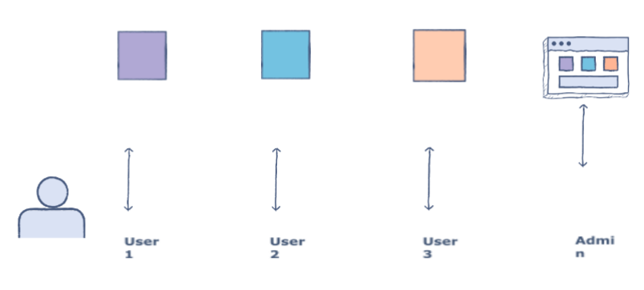
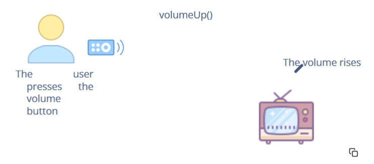

# **Abstraction**

## **Definition:-**

Abstraction in Object-Oriented Programming refers to showing only the essential features of an object to the user and hiding the inner details to reduce complexity. It can be put this way that the user only has to know “what an object does?” rather than “how it does?”.

**Real-world Examples**

 

 

The above illustration of the users and the admin of an application is a good real-world example of abstraction

A user can only use and interact with the limited features of an application and is unaware of the implementation details or the way the application was developed. Usually, the users are only concerned with the functionality of an application.

An admin can have the access to a lot more features of the application and nothing is hidden from him. The admin can monitor the activity of the users, knows how the application was developed and can implement new features by deploying them in the application.

In the above example, the abstraction is being applied to the user but not to the admin.

 

 

Let’s look into another example of abstraction. Take the Volume button on a television remote. With a click of a button, we request the T.V. to increase its volume. Let’s say the button calls the Volume Up() function. The T.V. responds by producing a sound larger than before. How the inner circuitry of the T.V. implements this is oblivious to us, yet we know the exposed function needed to interact with the T.V.'s volume.

## **An Example from Java**

In Java, one can very easily see abstraction in action. Let’s take an example of Java Math class. There are a lot of in-built methods in this class that can be used by the programmer to get facilitated. Let’s use a few methods in our code to access the in-built functionality:

    class TestAbstraction {
        public static void main( String args[] ) {
            int min = Math.min(15,18); //find min of two numbers
            double square = Math.pow(2,2); //calculate the power of a number
            System.out.println("The min of 15 & 18 is: "+ min); System.out.println("The square of 2 is: " + square)
        }
    }

In the above code:

- Math.min() find min of two num
- Math.max() find max of two num

But the user doesn’t have to know about the implementation of these two methods inside the Math class

## **Abstract Data Types**

By the definition of abstract data types, the users only get to know the essentials i.e. the functionality of those data types, and the ‘how the implementation should be done to achieve the specified functionality?’ part is hidden.

An example of abstract data type can be built in stack class in java in which the user knows that it has pop push functions but the user doesn’t know how there are implemented

## **Rules for java abstract class:-**

 

 

## **How can we implement abstraction in java?**

**Employee.java**

    public abstract class Employee {
        private String name;
        private String address;
        private int number;
        public Employee(String name, String address, int number) {
            System.out.println("Constructing an Employee");
            this.name = name;
            this.address = address;
            this.number = number;
        }
        public double computePay() {
            System.out.println("Inside Employee computePay");
            return 0.0;
        }
        public void mailCheck() {
            System.out.println("Mailing a check to " + this.name + " " + this.address);
        }
        public String toString() {
            return name + " " + address + " " + number;
        }
        public String getName() {
            return name;
        }
        public String getAddress() {
            return address;
        }
        public void setAddress(String newAddress) {
            address = newAddress;
        }
        public int getNumber() {
            return number;
        }
    }

when you will compiler this code by creating the object of the employee class you will get to know that this will fall into error as this violates the rules of abstraction.AS you can not create an object of the abstract class instead you can inherit it.

**AbstractDemo.java**

    public class AbstractDemo {
        public static void main(String [] args) {
            
            // following is not allowed and would raise error
            Employee e = new Employee("George W.", "Houston, TX", 43);
            System.out.println("\n Call mailCheck using Employee reference--");
            e.mailCheck();
        }
    }

**Output:-**

    AbstractDemo.java:5: error: Employee is abstract; cannot be instantiated
            Employee e = new Employee("George W.", "Houston, TX", 43);
                        ^
    1 error

Now we will follow the abstraction rules. we will not create the object directly instead we will inherit the abstract class first and implement the abstract methods of the parent class in the child class then we will create the object of the child class.

**Salary.java**

    public class Salary extends Employee {
        private double salary; // Annual salary
        public Salary(String name, String address, int number, double salary) {
            super(name, address, number);
            setSalary(salary);
        }
        public void mailCheck() {
            System.out.println("Within mailCheck of Salary class ");
            System.out.println("Mailing check to " + getName() + " with salary " + salary);
        }
        public double getSalary() {
            return salary;
        }
        public void setSalary(double newSalary) {
            if(newSalary >= 0.0) {
                salary = newSalary;
            }
        }
        public double computePay() {
            System.out.println("Computing salary pay for " + getName());
            return salary/52;
        }
    }

**AbstractDemo.java**

    public class AbstractDemo {

        public static void main(String[] args){
            Salary s = new Salary("Mohd Mohtashim", "Ambehta, UP", 3, 3600.00);
            Employee e = new Salary("John Adams", "Boston, MA", 2, 2400.00);
            System.out.println("Call mailCheck using Salary reference --");
            s.mailCheck();
            System.out.println("\n Call mailCheck using Employee reference--");
            e.mailCheck();
        }
    }

**Output:-**

    Constructing an Employee
    Constructing an Employee
    Call mailCheck using Salary reference --
    Within mailCheck of Salary class
    Mailing check to Mohd Mohtashim with salary 3600.0

    Call mailCheck using Employee reference--
    Within mailCheck of Salary class
    Mailing check to John Adams with salary 2400.0

