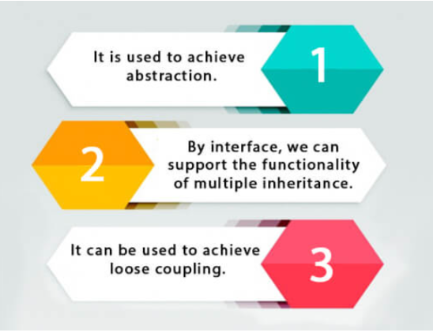
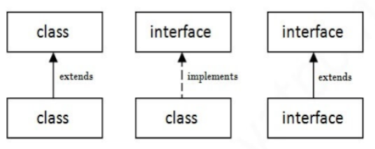
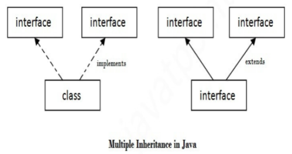

# **Interface**

## **Definition:-**

An interface can be thought of as a contract that a class has to fulfill while implementing an interface. According to this contract, the class that implements an interface has to @Override all the abstract methods declared in that very interface.

An interface can be used to achieve 100% abstraction as it contains the method signatures/abstract methods(what to be done) and no implementation details (how to be done) of these methods. In this way, interfaces satisfy the definition of abstraction. The implementation techniques of the methods declared in an interface are totally up to to the classes implementing that interface.

## **Declaration**

the interface is declared with the Interface keyword

    interface interfaceName {
        // Code goes here
    }

## **Why do we use an interface?**

 

 

## **The relationship between classes and interfaces**

a class extends another class, an interface extends another interface, but a class implements an interface.

 

 

## **Example of interface**

**Main.java**

    interface printer{
        void print();
    }

    class printable implements printer{
        public void print(){
            System.out.println("Hello");
        }
    }

    class Main{
        public static void main(String[] args) {
            printable p = new printable();
            p.print();
        }
    }

**Output:**

    Hello

## **Multiple inheritance in java through the interface**

If a class implements multiple interfaces, or an interface extends multiple interfaces, it is known as multiple inheritance.

 

 

## **An Example of multiple inheritance using the interface**

**Main.java**

    interface printer{
        void print();
    }

    interface showable{
        void show();
    }

    class Printable implements printer, showable{
        public void print(){
            System.out.println("Hello");
        }
        public void show(){
            System.out.println("Welcome");
        }
    }

    class Main{
        public static void main(String[] args) {
            Printable p = new Printable();
            p.print();
            p.show();
        }
    }

**Output:**
    
    Hello
    Welcome